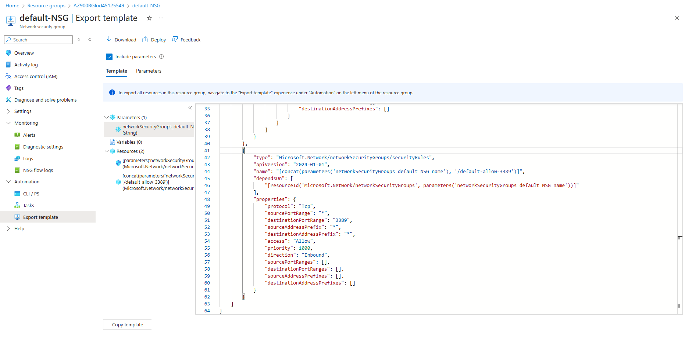

# Azure Resource Manager Template Export and Virtual Machine Deployment

This guide provides step-by-step instructions for exporting an Azure Resource Manager (ARM) template and deploying a virtual machine (VM) using a custom ARM template.

## Prerequisites

- Access to the Azure portal.
- An Azure account with admin privileges.

## Steps to Export an ARM Template

### 1. Sign In to the Azure Portal
- Go to the [Azure portal](https://portal.azure.com) and sign in using your admin account credentials.

### 2. Export ARM Template for a Storage Account
- On the **Azure home page**, navigate to **Storage accounts**.
- Select the storage account `sa45125549`.
- In the storage account menu, expand **Automation**, and then select **Export template**.
- On the **Export template** page, click **Download** to save the ARM template to your local computer.
- Review the exported JSON template file and locate the following key:
  - **`resources - sku - name`**: `Standard_LRS`

> If the storage account does not appear immediately, wait for a few minutes and refresh the page.

### 3. Examine the Exported Template
- The downloaded `.zip` file will contain two JSON files:
  1. **ARM template** – Defines the resources.
  2. **Parameters file** – Contains the deployment parameters.

## Deploy a Virtual Machine Using a Custom ARM Template

### 1. Deploy from a GitHub ARM Template
- Open a new browser window and go to the following GitHub repository:  
  [Simple Windows VM Template](https://github.com/LODSContent/ChallengeLabs_ArmResources/tree/master/ARMTemplates/101-vm-simple-windows)
- Review the details of the ARM template for deploying a Windows VM.
- Click **Deploy to Azure** to begin the deployment process.

### 2. Edit the VM Name in the ARM Template
- In the **Custom deployment** page, select **Edit template**.
- Expand **Variables** and locate the `vmName` variable (approximately on line 61).
- Change the `vmName` value to **MyVM** and save the changes.

### 3. Deploy the Virtual Machine
- Fill in the deployment details as follows:
  - **Resource Group**: `AZ900RGlod45125549`
  - **Admin Username**: *(enter your admin username)*
  - **Admin Password**: *(enter your admin password)*
  - **DNS Label Prefix**: `myvm45125549`
  - **Windows OS Version**: `2019-Datacenter`
  - **VM Size**: `Standard_D2s_v3`

- Agree to the terms and conditions, then click **Review + Create**, and select **Create** to deploy the VM.

> Make sure to use the exact values as shown to avoid deployment issues.

## Summary

In this guide, we have successfully:
1. Exported an ARM template for the `sa45125549` storage account.
2. Deployed a virtual machine using a custom ARM template.

## Additional Resources
- [Azure Resource Manager Templates](https://learn.microsoft.com/en-us/azure/azure-resource-manager/templates/overview)
- [Deploy and manage Azure resources with ARM templates](https://learn.microsoft.com/en-us/azure/azure-resource-manager/templates/template-deployment-overview)

## Screenshot of Exported ARM Template

