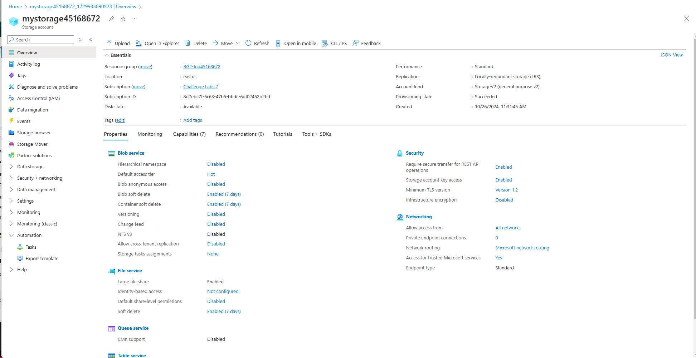

# Manage Azure Resource Groups Challenge Lab

This repository documents my completion of the **Manage Azure Resource Groups Challenge Lab** as part of my preparation for the Microsoft AZ-900 certification.

## Lab Overview

In this lab, I practiced managing Azure resources by performing essential tasks with Azure resource groups. This included viewing, creating, and managing resources within the Azure portal.

### Objectives Achieved
1. **Viewed Resources in an Azure Resource Group**  
   Accessed and reviewed the resources available within the specified Azure resource groups.

2. **Created a Resource in an Azure Resource Group**  
   Successfully created an Azure Storage Account (`mystorage45168672`) within the resource group `RG2-lod45168672` using default configurations.

3. **Reviewed Management Options of Azure Resources**  
   Explored various management options for Azure resources via the Azure portal, including command bar and service menu options.

## Steps Performed
1. **Viewed Existing Resource Groups**  
   Verified the presence of two resource groups: `RG1-lod45168672` and `RG2-lod45168672`.

2. **Created an Azure Storage Account**  
   - Navigated to the `RG2-lod45168672` resource group.
   - Created a new storage account named `mystorage45168672` using default values.
   - Verified the successful creation of the storage account.

3. **Reviewed Management Options in Azure Portal**  
   - Accessed the Overview page of `mystorage45168672` to view properties like the location (`eastus`).
   - Explored available options in the command bar and service menu for better understanding of resource management capabilities in Azure.

# Screenshot

Below is a screenshot of the **Storage Account Overview** page:

---

## Conclusion

In this lab, I successfully managed an Azure resource group by creating a storage account, exploring its properties, and reviewing available management options. This knowledge is essential for efficient Azure resource organization and management.

---

## Resources
- [Microsoft Learn: Azure Fundamentals](https://learn.microsoft.com/en-us/training/azure)
- [Azure Resource Manager Documentation](https://learn.microsoft.com/en-us/azure/azure-resource-manager/)
