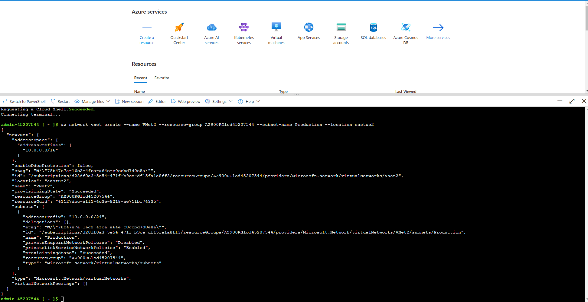

# Run Commands by Using Azure Cloud Shell

This repository documents the **Run Commands by Using Azure Cloud Shell** lab completed on Microsoft Azure. The lab involved configuring Azure Cloud Shell, deploying virtual networks using both Azure PowerShell cmdlets and Azure CLI 2.0 commands, and verifying configurations.

## Overview

In this lab, I acted as an administrator responsible for managing the Azure environment for Hexelo. The tasks included:

1. Setting up **Azure Cloud Shell** for the first time.
2. Using **PowerShell** cmdlets to create a virtual network.
3. Using **Azure CLI 2.0** commands to create another virtual network.

This lab provided hands-on experience with executing commands and deploying resources in Azure using both **PowerShell** and **Bash** interfaces in **Azure Cloud Shell**.

## Requirements

- **Azure Subscription** with access to **Azure Cloud Shell**.
- **Resource Group**: AZ900RGlod45207544
- **Region**: East US 2

## Steps

### 1. Configure Azure Cloud Shell
   - Opened Azure Cloud Shell and selected **PowerShell**.
   - Mounted a storage account in the existing resource group **AZ900RGlod45207544**.
   - Created a file share named **shell** for storage.

### 2. Deploy a Virtual Network Using PowerShell
   - Created a virtual network named **VNet1** in the **East US 2** region with the address space **10.0.0.0/16** using the following command:

     ```powershell
     $virtualNetwork = New-AzVirtualNetwork -ResourceGroupName "AZ900RGlod45207544" -Location "EastUS2" -Name "VNet1" -AddressPrefix "10.0.0.0/16"
     ```

   - Retrieved **VNet1** into a variable and added a subnet named **Production** with an address prefix **10.0.0.0/24**:

     ```powershell
     $Vnet = Get-AzVirtualNetwork -Name "VNet1" -ResourceGroupName "AZ900RGlod45207544"
     $subnetConfig = Add-AzVirtualNetworkSubnetConfig -Name "Production" -VirtualNetwork $Vnet -AddressPrefix "10.0.0.0/24"
     $Vnet | Set-AzVirtualNetwork
     ```

### 3. Deploy a Virtual Network Using Azure CLI
   - Switched to **Bash** in Azure Cloud Shell.
   - Created a second virtual network named **VNet2** in the **East US 2** region with the **Production** subnet using:

     ```bash
     az network vnet create --name VNet2 --resource-group AZ900RGlod45207544 --subnet-name Production --location eastus2
     ```

### Verification

To verify the deployment, you can run the following command:

```bash
az network vnet list --resource-group AZ900RGlod45207544 --output table
```
# Screenshot

Below is a screenshot of the **VNet2 Overview**:

