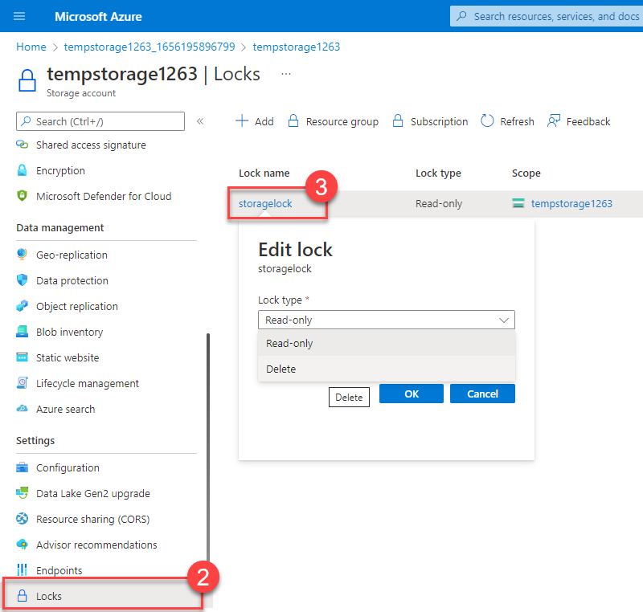
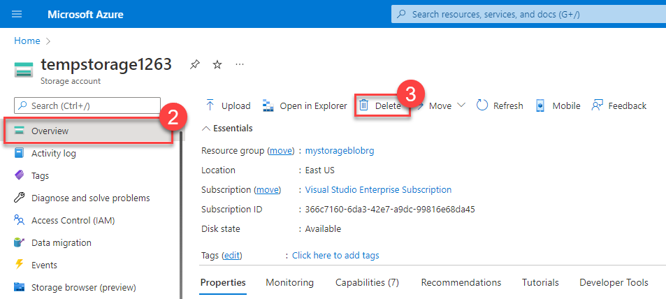
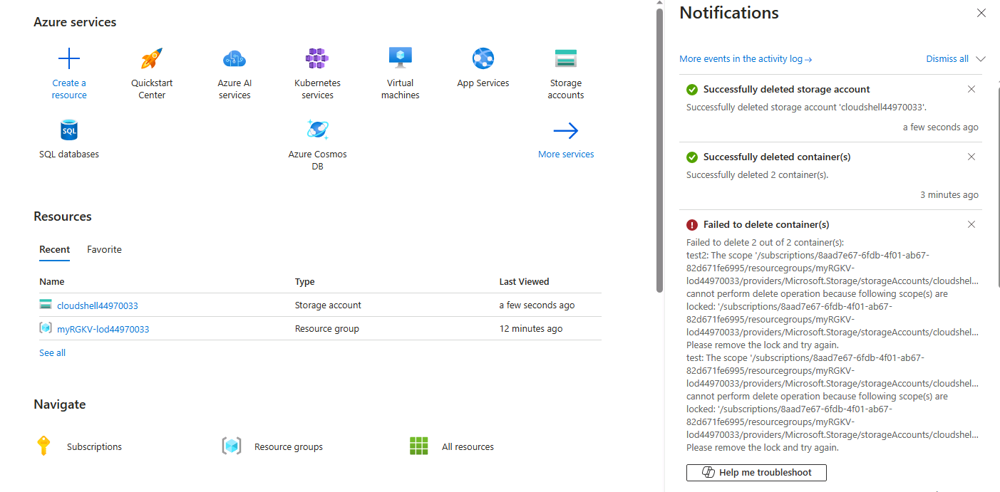

# Configure a Resource Lock

## Overview:
In this exercise, I created a resource and configured a resource lock in Azure. Below are the steps and the screenshots that demonstrate the process.

---

### Task 1: Create a Resource
1. Logged in to the [Azure Portal](https://portal.azure.com).
2. Created a storage account with the following settings:
   - **Resource group**: `myRGKV-lodxxxxxx`
   - **Storage account name**: `cloudshellxxxxxx`
   - **Region**: Default
   - **Performance**: Standard
   - **Redundancy**: Locally redundant storage (LRS)
3. Validated and created the resource.

### Task 2: Apply a Read-Only Resource Lock
1. Navigated to the **Locks** section of the storage account.
2. Added a **Read-only** lock.

**Screenshot:**

---

### Task 3: Add a Container to the Storage Account
1. Tried adding a container to the storage account, which failed due to the read-only lock.

**Screenshot:**

---

### Task 4: Modify the Resource Lock and Create a Container
1. Changed the lock type to **Delete** and successfully added a container to the storage account.

**Screenshot:**

---

### Task 5: Delete the Storage Account
1. Attempted to delete the storage account, which failed due to the delete lock.
2. Removed the delete lock and successfully deleted the storage account.

**Screenshot:**

---

## Conclusion:
This lab exercise demonstrated how resource locks can prevent unwanted changes or deletions to Azure resources. By applying and modifying locks, you can ensure resources remain secure.