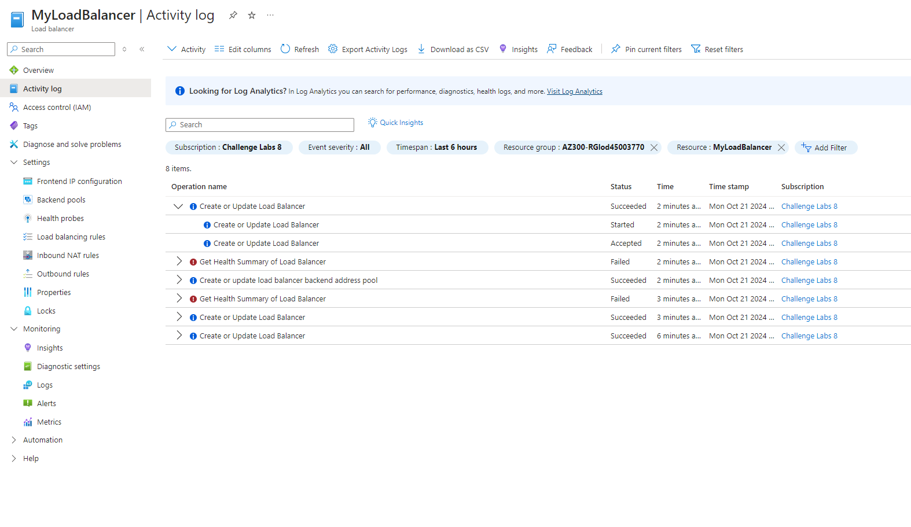

# Azure Load Balancer Challenge

## Challenge Overview
In this challenge, I implemented a **Standard Azure Load Balancer** for the organization Hexelo. The task involved setting up a public load balancer, configuring backend resources, and distributing HTTP traffic across multiple virtual machines.

## Key Steps:
1. **Created a Load Balancer:**
   - Name: `MyLoadBalancer`
   - Region: `East US`
   - SKU: `Standard`
   - Type: `Public`

2. **Configured Backend Pool:**
   - Virtual network: `MyVNet`
   - Added Virtual Machines: `VM1`, `VM2`, `VM3`

3. **Created Health Probe:**
   - Name: `MyHealthProbe`
   - Protocol: `HTTP`
   - Port: `80`
   - Interval: `15 seconds`

4. **Set Up Load Balancing Rule:**
   - Frontend IP: `LB-FIP45003770`
   - Backend Pool: `MyBackendPool`
   - Port: `80`
   - Health Probe: `MyHealthProbe`

## Success:
All components were successfully deployed, and traffic is now evenly distributed across the virtual machines in the backend pool.

### Final Screenshot:

